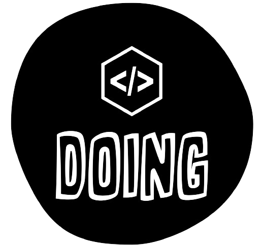

<!-- Improved compatibility of back to top link: See: https://github.com/othneildrew/Best-README-Template/pull/73 -->
<a name="readme-top"></a>
<!--
*** Thanks for checking out the Best-README-Template. If you have a suggestion
*** that would make this better, please fork the repo and create a pull request
*** or simply open an issue with the tag "enhancement".
*** Don't forget to give the project a star!
*** Thanks again! Now go create something AMAZING! :D
-->


<!-- PROJECT SHIELDS -->
<!--
*** I'm using markdown "reference style" links for readability.
*** Reference links are enclosed in brackets [ ] instead of parentheses ( ).
*** See the bottom of this document for the declaration of the reference variables
*** for contributors-url, forks-url, etc. This is an optional, concise syntax you may use.
*** https://www.markdownguide.org/basic-syntax/#reference-style-links
-->
[![Contributors][contributors-shield]][contributors-url]
[![Forks][forks-shield]][forks-url]
[![Stargazers][stars-shield]][stars-url]
[![Issues][issues-shield]][issues-url]
[![MIT License][license-shield]][license-url]
[![LinkedIn][linkedin-shield]][linkedin-url]


<!-- PROJECT LOGO -->
<br />
<div align="center">
  <a href="https://github.com/yingtu35/IssuesManager">
    
  </a>

<h3 align="center">Issues Manager
</h3>

  <p align="center">
    A simple issue manager website for your GitHub repositories
    <br />
    <a href="https://github.com/yingtu35/IssuesManager"><strong>Explore the docs »</strong></a>
    <br />
    <br />
    <a href="https://github.com/yingtu35/IssuesManager">View Demo</a>
    ·
    <a href="https://github.com/yingtu35/IssuesManager/issues">Report Bug</a>
    ·
    <a href="https://github.com/yingtu35/IssuesManager/issues">Request Feature</a>
  </p>
</div>


<!-- TABLE OF CONTENTS -->
<details>
  <summary>Table of Contents</summary>
  <ol>
    <li>
      <a href="#about-the-project">About The Project</a>
      <ul>
        <li><a href="#built-with">Built With</a></li>
      </ul>
    </li>
    <li>
      <a href="#getting-started">Getting Started</a>
      <ul>
        <li><a href="#prerequisites">Prerequisites</a></li>
        <li><a href="#installation">Installation</a></li>
      </ul>
    </li>
    <li><a href="#usage">Usage</a></li>
    <li><a href="#roadmap">Roadmap</a></li>
    <li><a href="#contributing">Contributing</a></li>
    <li><a href="#license">License</a></li>
    <li><a href="#contact">Contact</a></li>
    <!-- <li><a href="#acknowledgments">Acknowledgments</a></li> -->
  </ol>
</details>


<!-- ABOUT THE PROJECT -->
## About The Project

[![Product Name Screen Shot][product-screenshot]](https://example.com)

IssuesManager is an application allowing GitHub users to manage issues in one single site.

Treating issues as blogs, users can create, edit, and close on issues. Users can also view all the issues in a list view, and click on each issue to view the details.

<p align="right">(<a href="#readme-top">back to top</a>)</p>


### Built With

* [![NextJS][NextJS.org]][NextJS-url]
* [![React][React.js]][React-url]
* [![TypeScript][TypeScript.org]][TypeScript-url]
* [![Tailwind][Tailwind.com]][Tailwind-url]
* [![Zod][Zod.dev]][Zod-url]

<p align="right">(<a href="#readme-top">back to top</a>)</p>


<!-- GETTING STARTED -->
## Getting Started

Follow these steps to run the application in your host machine or inside Docker containers.

### Prerequisites

To run the application in your host machine, you need to have **npm** set up. Otherwise, you can choose to use Docker,
* **npm**
  
  Recommend using nvm for Node version management

  [nvm][nvm-url]
* **Docker**
  
  Use docker to easily build, and run the application

  [Docker][Docker.com]

### Installation
* **Run in the host machine**
1. Clone the repo
   ```sh
   git clone https://github.com/yingtu35/IssuesManager.git
   ```
2. Install NPM packages on both backend and frontend folders
   ```sh
   npm install
   ```
3. Create a .env file in the backend folder for mongodb url and jwt secret
   ```sh
   TEST_MONGODB_URL=paste your testing mongo url here
   MONGODB_URL=paste your mongodb url here
   SECRET=paste your jwt secret here
   ```
4. Create a .env file in the frontend folder for connection to the backend service
    ```sh
    REACT_APP_BACKEND_URL=http://localhost:portForYourBackend
    ```
5. Start both server in the development mode
    * backend
      ```sh
      npm run start:test
      ```
     * frontend
       ```sh
       npm start
       ```

* **Run in Docker**
1. Clone the repo
   ```sh
   git clone https://github.com/yingtu35/IssuesManager.git
   ```
2. In IssuesManager directory, run the container in either development mode or production mode
     * development
        ```sh
        docker compose -f docker-compose.dev.yml up
        ```
     * production
        ```sh
        docker compose up
        ```
  

<p align="right">(<a href="#readme-top">back to top</a>)</p>


<!-- USAGE EXAMPLES -->
## Usage

Enjoy the short 2-min demo to see how IssuesManager works.

[Demo][demo-url]

[](http://www.youtube.com/watch?v=MnJX33HtIVE "IssuesManager demo")

<p align="right">(<a href="#readme-top">back to top</a>)</p>


<!-- ROADMAP -->
## Roadmap

- [ ] Add sign up UI 
- [ ] Search bar for blogs
- [ ] Search bar for users
- [ ] Better view for comments
- [ ] Deploy to a remote server
    <!-- - [ ] Nested Feature -->

See the [open issues](https://github.com/yingtu35/IssuesManager/issues) for a full list of proposed features (and known issues).

<p align="right">(<a href="#readme-top">back to top</a>)</p>


<!-- CONTRIBUTING -->
## Contributing

Contributions are what make the open source community such an amazing place to learn, inspire, and create. Any contributions you make are **greatly appreciated**.

If you have a suggestion that would make this better, please fork the repo and create a pull request. You can also simply open an issue with the tag "enhancement".
Don't forget to give the project a star! Thanks again!

1. Fork the Project
2. Create your Feature Branch (`git checkout -b feature/AmazingFeature`)
3. Commit your Changes (`git commit -m 'Add some AmazingFeature'`)
4. Push to the Branch (`git push origin feature/AmazingFeature`)
5. Open a Pull Request

<p align="right">(<a href="#readme-top">back to top</a>)</p>


<!-- LICENSE -->
## License

Distributed under the MIT License. See `LICENSE.txt` for more information.

<p align="right">(<a href="#readme-top">back to top</a>)</p>


<!-- CONTACT -->
## Contact

Ying Tu - yingtu35@gmail.com

Twitter: [@YingTu1685990](https://twitter.com/YingTu1685990)

LinkedIn: [Ying Tu](https://www.linkedin.com/in/yingtu/)

Project Link: [IssuesManager](https://github.com/yingtu35/IssuesManager)


<p align="right">(<a href="#readme-top">back to top</a>)</p>

<!-- MARKDOWN LINKS & IMAGES -->
<!-- https://www.markdownguide.org/basic-syntax/#reference-style-links -->
[contributors-shield]: https://img.shields.io/github/contributors/yingtu35/IssuesManager.svg?style=for-the-badge
[contributors-url]: https://github.com/yingtu35/IssuesManager/graphs/contributors
[forks-shield]: https://img.shields.io/github/forks/yingtu35/IssuesManager.svg?style=for-the-badge
[forks-url]: https://github.com/yingtu35/IssuesManager/network/members
[stars-shield]: https://img.shields.io/github/stars/yingtu35/IssuesManager.svg?style=for-the-badge
[stars-url]: https://github.com/yingtu35/IssuesManager/stargazers
[issues-shield]: https://img.shields.io/github/issues/yingtu35/IssuesManager.svg?style=for-the-badge
[issues-url]: https://github.com/yingtu35/IssuesManager/issues
[license-shield]: https://img.shields.io/github/license/yingtu35/IssuesManager.svg?style=for-the-badge
[license-url]: https://github.com/yingtu35/IssuesManager/blob/master/LICENSE.txt
[linkedin-shield]: https://img.shields.io/badge/-LinkedIn-black.svg?style=for-the-badge&logo=linkedin&colorB=0A66C2
[linkedin-url]: https://linkedin.com/in/yingtu
[product-screenshot]: public/doing-desktop3.png
[React.js]: https://img.shields.io/badge/React-20232A?style=for-the-badge&logo=react&logoColor=61DAFB
[React-url]: https://reactjs.org/
[Tailwind.com]: https://img.shields.io/badge/tailwindcss-06B6D4?style=for-the-badge&logo=Tailwindcss&logoColor=white
[Tailwind-url]: https://tailwindcss.com/
[NextJS.org]: https://img.shields.io/badge/NextJS-000000?style=for-the-badge&logo=nextdotjs&logoColor=white
[NextJS-url]: https://nextjs.org/
[TypeScript.org]: https://img.shields.io/badge/TypeScript-3178C6?style=for-the-badge&logo=typescript&logoColor=white
[TypeScript-url]: https://www.typescriptlang.org/
[Zod.dev]: https://img.shields.io/badge/Zod-3E67B1?style=for-the-badge&logo=zod&logoColor=white
[Zod-url]: https://zod.dev/
[demo-url]: https://youtu.be/sCE-lH05nV4
****